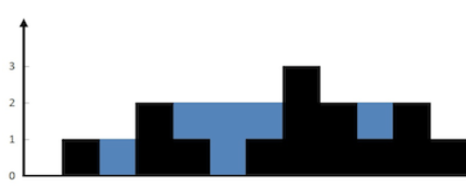

# 接雨水

## 单调栈法
单调栈解决的问题：
1.寻找左/右边第一个比自己大/小的数
2.保持降序升序
3.区间面积，蓄水

代码
```c++
for (int i = 0; i < n; i++) {
    while (!stk.empty() && height[i] >= stk.top()) {
        int bottom = stk.top();
        stk.pop();
        if (!stk.empty()) {
            int left = stk.top();
            ans += (min(height[left],height[i]) * (i - left - 1) - height[bottom]);
        }
    }
    stk.push(i);
}
```
对于本题，其实是相当于横向填充，注意横向坐标差
# DP
代码
```c++
for (int i = 0; i < n; i++) {
    left_max = max(left_max, height[i]);
}
for (int i = n - 1; i >= 0; i--) {
    right_max = max(right_max, height[i]);
}
for (int i = 0; i < n; i++) {
    ans += min(left_max, right_max) - height[i];
}
```
核心思路就是每一个格子竖着算
## 双指针

核心是对DP的优化，我们只需要获得较小的那个而不是两者的准确值，那就可以从两端维护，显然，如果left_max都已经大于右边的right_max了话，left_max[i]中最大的显然也大于右边

```c++
while (left < right) {
    left_max = max(left_max, height[left]);
    right_max = max(right_max, height[right]);
    if (left_max > right_max) {
        ans += right_max - height[right];
        right--;
    }else{
        ans += left_max - height[left];
        left++;
    }
}
```