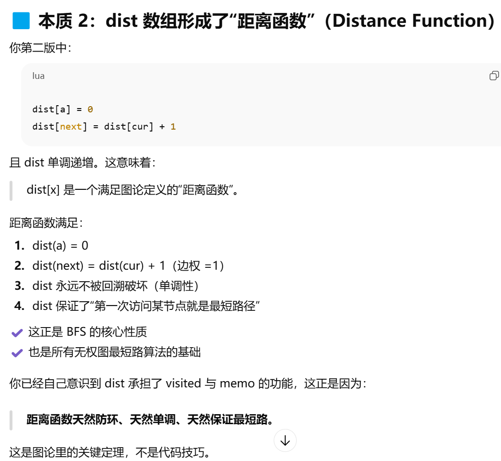

# P1135 奇怪的电梯

## 题目背景

感谢 @[yummy](https://www.luogu.com.cn/user/101694) 提供的一些数据。

## 题目描述

呵呵，有一天我做了一个梦，梦见了一种很奇怪的电梯。大楼的每一层楼都可以停电梯，而且第 $i$ 层楼（$1 \le i \le N$）上有一个数字 $K_i$（$0 \le K_i \le N$）。电梯只有四个按钮：开，关，上，下。上下的层数等于当前楼层上的那个数字。当然，如果不能满足要求，相应的按钮就会失灵。例如： $3, 3, 1, 2, 5$ 代表了 $K_i$（$K_1=3$，$K_2=3$，……），从 $1$ 楼开始。在 $1$ 楼，按“上”可以到 $4$ 楼，按“下”是不起作用的，因为没有 $-2$ 楼。那么，从 $A$ 楼到 $B$ 楼至少要按几次按钮呢？

## 输入格式

共二行。  

第一行为三个用空格隔开的正整数，表示 $N, A, B$（$1 \le N \le 200$，$1 \le A, B \le N$）。

第二行为 $N$ 个用空格隔开的非负整数，表示 $K_i$。

## 输出格式

一行，即最少按键次数，若无法到达，则输出 `-1`。

## 输入输出样例 #1

### 输入 #1

```
5 1 5
3 3 1 2 5
```

### 输出 #1

```
3
```

## 说明/提示

对于 $100 \%$ 的数据，$1 \le N \le 200$，$1 \le A, B \le N$，$0 \le K_i \le N$。

本题共 $16$ 个测试点，前 $15$ 个每个测试点 $6$ 分，最后一个测试点 $10$ 分。


***OK啊孩子们这个题可以说是非常全面了，让我们看看是怎么一步步学到很多东西的***

# 一道夯爆了的图论＋搜索题的学习笔记
## 题目初尝试


### 暴力dfs
```
我的思路是这样，可以用深度和广度优先，这里先用深度，
先把给到的每层数字记录在数组中，这里数组我们使用1-based，然后使用dfs，
这里因为可能到不了，以及防止循环，需要用一个visited数组记录每一层是否到达，


dfs函数我们这样写，接受两个参数，从哪一层到哪一层，返回所需的最少次数，
到达不了则返回0x3f3f3f3f,方便以后的最小值判断，

首先考虑两个方向，返回dfs最小值+1（即min(dfs(cur + k[cur],tar),dfs(cur - k[cur],tar)+1），填入对应参数，这里visited数组作为全局数组，
表示到一次就不用考虑了，对于一次查询这是合理的，（另外，这里你可以告诉我怎么处理多次查询?在每次查询后重置visited数组吗），

如果cur（第一个参数）== tar，即可以返回1，表示按一次可以到.

最后在主函数中调用dfs(a,b)即可
```
#### 小插曲
在解决记忆化之前，我们来看看原始代码中可以学习的地方
```c++
int dfs(int cur, int tar){
    if (cur == tar) return MAX;
    if (cur <= 0 || cur > n) return MAX;
    if (memo[cur][tar] != MAX) return memo[cur][tar];
    memo[cur][tar] =  min(dfs(cur + k[cur], tar),dfs(cur - k[cur], tar) + 1);
    return memo[cur][tar];
}
```
这个是初始版本，因为最初觉得memo数组可以代替visited，就直接这样写了，来看看问题
1.b是全局变量，可以直接优化一个参数
2.memo不可以代替visited,当时的主观思路，我想现在不用解释了
3.如果两个都不满足，返回其实是MAX + 1，虽然后续也可以判断，但是MAX表示的其实是不可达，MAX + 1反而表示一个很大值，所以为了明确含义，我们更好的方式是这样写
```c++
int up = cur + k[cur];
int down = cur - k[cur];//变量代替坐标更清晰
int best = MAX;
int up_ans = (up > n) ? MAX : dfs(up);
int down_ans = (down < 1) ? MAX : dfs(down);
//这里如果用if判断然后比较的话会增加dfs调用，所以用变量up_ans储存起来再用到best上
if (up_ans != MAX) best = min(best, up_ans);
if (down_ans != MAX) best = min(best, down_ans);
memo[cur] = best;

```
4.
```c++
cout << (ans >= MAX / 2) ? -1 : ans;
```
你敢想这个是错的吗，还是都加上括号稳(<<优先级更高)

5.问题来了，visited数组可能会阻止不同路径，尤其是先走的那条路径返回值是max,这时候真正的最短路会被visited阻塞，（这里其实就能意识到用bfs更好了，或者说看到最短路就该用bfs）
所以最终修改版是这样
（尝试一下，是否能自己举出反例？）
```c++
int dfs(int cur){
    if (visited[cur] == 1) return MAX;
    if (cur == b) return 0;
    if (memo[cur] != -1) return memo[cur];

    visited[cur] = 1;//框架

    int up = cur + k[cur];
    int down = cur - k[cur];
    int up_ans = (up <= n) ? dfs(up) : MAX;
    int down_ans = (down > 0) ? dfs(down) : MAX;
    int best = MAX;
    if (up_ans != MAX) best = min(best, up_ans + 1);
    if (down_ans != MAX) best = min(best, down_ans + 1);
    memo[cur] =  best;

    visited[cur] = 0;//回溯

    return memo[cur];
}
```


这里基本思路其实是对的，但是不memo贴上去会tle，邪恶的AI提示我们用memo数组来记忆化，来看看问题在哪

对照上面的代码，不妨举几个例子，其实很难举，在国产各个AI全举不出来以及gpt在样例帮助下才举出来，其实是这样的

a = 4,b = 1,这里的3由于第一个圈4-5-6-2-3被标记为MAX了


问题不是memo数组或者visited数组，而是二者的联合作用，在visited的特定情况下，memo数组会错误的把某些位置记错，其实这只是这条路径下的问题，这就涉及到下面要说的了

### dfs剪枝模拟bfs
visited数组的作用是防止环，但其实我们应该也可以想到防止环还有一种方式，就是通过长度剪枝，如果现在得到的长度比之前储存的长度还要长，那就没有更新的必要了。
代码如下：
```c++
if (up <= n && dist[cur] + 1 < dist[up]) {
    ...//dist[x]表示当前x到a的最短距离
}
```
用dist数组的判断来代替visited数组避免环，我们就可以得到一版新的代码
```c++
int dfs(int cur){//dfs[cur]表示cur节点到b的最短路径
    if (cur == b) return 0;
    if (k[cur] == 0) return MAX;
    int up = cur + k[cur];
    int down = cur - k[cur];
    int up_ans = MAX, down_ans = MAX;
    if (up <= n && dist[up] > dist[cur] + 1) {
        dist[up] = dist[cur] + 1;//注意更新时机
        up_ans = dfs(up);
    }
    if (down > 0 && dist[down] > dist[cur] + 1) {
        dist[down] = dist[cur] + 1;
        down_ans = dfs(down);
    }
    int best = MAX;
    if (up_ans != MAX) {
        best = min(best, up_ans + 1);
    }
    if (down_ans != MAX ) {
        best = min(best, down_ans + 1);
    }
    return best;
}
```
其实还可以更简化，因为dist数组就可以代表a到任何点的距离了，所以函数可以不需要返回值，直接输出dist[b]，同时，这时的dfs可以用手动压栈代替了


那么我们很容易联想到，dist数组和我的memo数组有什么区别呢?我们直接用memo数组也不要visited数组能不能实现呢?
关键在dist[a] = 0;这样dist[cur] + 1 < dist[next]是可以判断的了，所以如果是memo，我们就需要反向遍历，这个时候其实两个数组就是等价的了，memo[b] = 0,来看看gpt怎么说



OK，现在是这一部分的总结
|序号|细节关键点|重要程度|序号|模版关键点|重要程度|
|---|---|---|---|---|---|
|1|边界(up >= 1而不是0)|⭐⭐|11|visited在dfs中的回溯模版|⭐⭐|
|2|答案是全局变量，可以优化参数|⭐|22|memo和visited同时存在时<br>由于状态依赖导致的错误|⭐⭐|
|3|cout和?的优先级|⭐|33|dfs通过dist剪枝模拟bfs|⭐|
|4|dist的更新时机|⭐|44|MAX返回值的优化写法|⭐⭐|


（我是来分割的）


## 正确想法：BFS
代码是好写的，注意一定要visited,关键：
```c++
visited[a] = 1;
```
这很重要
还有就是，visited的标记时机
```c++
    int cur = q.front();
    if (cur == b) {
        flg = 1;
        break;
    }
    q.pop();
    visited[cur] = 1;
    int up = cur + k[cur];
    int down = cur - k[cur];
    if (up <= n && !visited[up]) q.push(up);
    if (down >= 1 && !visited[down]) q.push(down);
```
这样会导致很多重复，入队时就应该标记
```c++
if (){
    visited[up] = 1;
    q.push(up);
}
```
同时，找到了最好直接返回，不然break后在下面ans--这样修正可能麻烦
```c++
if (cur == b) {
    cout << ans;//ans在外层循环中，每层递增
    return 0;
}
```
最后，这里一直错，因为没有用MAX,所以没在意返回值，注意无解时返回-1

总结一下bfs的点
|序号|关键点|重要性|
|---|---|---|
|1|visited数组的初始点|⭐⭐⭐|
|2|wisited的标记时机（入队）|⭐⭐|
|3|得到答案和无解的处理|⭐|


## 其他通过这道题复习的乱七八糟的做法
首先，把这道题建模成等权有向图的单源最短路就是个本事
### dijkstra

首先复习一下什么是dijkstra

每次找到   ***未访问过的***   ***最近点***
通过它来松弛其他边

显然，我们需要用队列来储存访问过的邻居（不然你不会想每次都遍历吧）
而且，我们要用的是最短的，所以自然想到小顶堆

需要注意的点：
小顶堆写法是：
```c++
priority_queue<pair<int,int>,vector<pair<int,int>>,greater<pair<int,int>>q;
```

因为第一个是比较对象，所以要变成{step,cur}，不要写反

同时，注意这里还有一个点，就是
```c++
if (step > dist[cur]) continue;
```
在更新过程中，原先进队的点可能已经不够优了

最后写一下模版
```c++
q.push({0,a});
while (!q.empty()) {
    auto [step, cur] = q.top();
    q.pop();
    if (cur == b) {
        ···
    }
    if (step > dist[cur]) continue;

    int up···
    if (up <= n && dist[cur] + 1 < dist[up]) {
        dist[up] = dist[cut] + 1;
        q.push({dist[up],up});
    }
}
```

总结一下
|序号|关键点|重要程度|
|---|---|---|
|1|小顶堆写法|⭐⭐|
|2|排序对二元组的要求|⭐⭐|
|3|dijkstra更新时的剪枝|⭐|
|4|dijkstra模版|⭐⭐|

